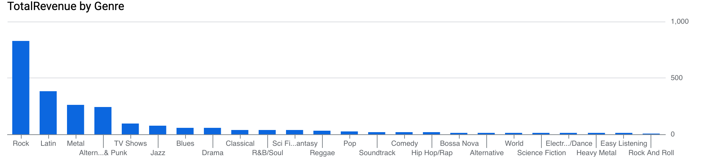
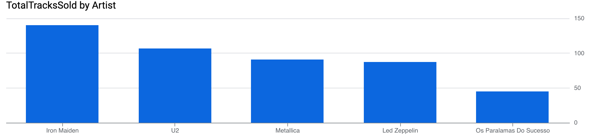

# 📊 Chinook SQL Analysis (BigQuery)

Аналитический проект по исследованию продаж музыкального магазина на основе базы данных Chinook.  
Проект выполнен с использованием SQL (BigQuery) и включает агрегации, JOIN-операции и визуализацию данных.

---

## 🔧 Используемые инструменты
- Google BigQuery
- SQL (JOIN, GROUP BY, SUM, COUNT, AVG, CTE)
- Data Visualization

---

## 📈 Анализ и визуализации

### 1️⃣ Total Revenue by Billing Country

**Описание:**  
График показывает общую выручку по странам.

**Вывод:**  
США являются крупнейшим рынком и значительно опережают остальные страны по объёму выручки.  
Канада, Франция и Бразилия занимают следующие позиции.

---

### 2️⃣ Total Revenue by Genre

**Описание:**  
График отражает суммарную выручку по музыкальным жанрам.

**Вывод:**  
Жанр Rock приносит наибольшую часть дохода компании и является основным драйвером продаж.

---

### 3️⃣ Top Artists by Track Sales

**Описание:**  
Показано количество проданных треков по артистам.

**Вывод:**  
Iron Maiden и U2 являются лидерами по количеству проданных треков, что подтверждает популярность рок-исполнителей.

---

### 4️⃣ Average Invoice by Country

**Описание:**  
График демонстрирует средний размер счета по странам.

**Вывод:**  
В ряде европейских стран средний чек выше, чем в США, что может свидетельствовать о различиях в покупательском поведении клиентов.

---

## 🎯 Общие выводы

- Основной рынок компании — США.
- Жанр Rock генерирует наибольшую выручку.
- Лидеры по продажам — Iron Maiden и U2.
- Средний чек различается по странам.

---

## 👩‍💻 Автор

Aruzhan Amirkhanova  
Data Analytics Student  
BigQuery | SQL | Data Analysis

