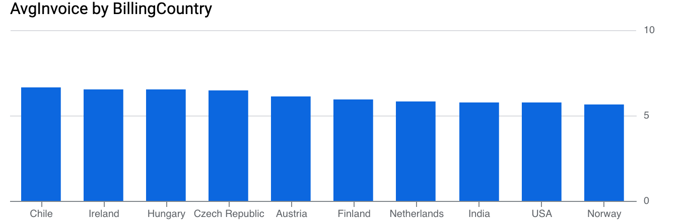

# Chinook SQL Analysis (BigQuery)

Аналитический проект по исследованию продаж музыкального магазина на базе Chinook.

## 🔧 Используемые инструменты
- BigQuery
- SQL (JOIN, GROUP BY, SUM, COUNT, AVG)
- Визуализация данных

## 📊 Ключевые инсайты

- США — крупнейший рынок по выручке.
- Жанр Rock приносит наибольший доход.
- Iron Maiden и U2 — лидеры по продажам.
- Средний чек различается по странам.

## 📈 Визуализации

### Топ стран по выручке

### Выручка по жанрам

### Топ артистов

### Средний чек

---

👩‍💻 Aruzhan Amirkhanova  
Data Analytics Student

